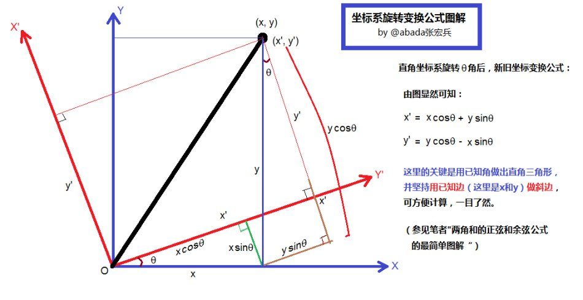

## 飞控相关的笔记

### 坐标系

* 地面坐标系
地球坐标系，也就是经纬度。地面坐标系，也就是在经纬度数据经过转换之后，北东地的一个坐标系。

* 机体坐标系
机头方向为X轴，垂直于X轴向下为Z轴，根据右手定则，确定Y轴。从加速度计和陀螺仪中可以获取，机体坐标系和地面坐标系的偏差，也就是roll、pitch、yaw三个姿态角。

* 坐标旋转问题
使用 **室内定位系统** 的时候，需要将室内定位坐标进行旋转，从而得到惯性坐标系（NED）中的坐标。需要注意的是，在室内定位系统的坐标系中， **横轴是X轴，纵轴是Y轴** 。而在惯性坐标系（NED）中， **横轴是Y轴，纵轴是X轴** 。因此，室内定位坐标经过旋转之后得到的惯性系中的坐标， **Y轴坐标是经过取反的** 。

#### 坐标旋转参考下图：

-----------------------------

### 航线飞行（制导律）

* 通过当前经纬度和第一个航点的经纬度（起飞时的位置信息），获取当前位置在地面坐标系的一个起始坐标和第一个航点在地面坐标系中的坐标，计算两者的偏差值。（备注：uav中的getLocalx()函数）
* 通过目标航点经纬度和起始航点经纬度，获取目标位置在地面坐标系的坐标和起始位置在地面坐标系中的坐标，计算两者的偏差值，作为航线飞行算法的输入。（备注：uav中的getLocale()函数）

* **航线飞行计算过程**
    1. 取 **设定的起始航点坐标和目标航点坐标** 作为参考。计算两点间向量坐标，并计算参考航向。
    2. 取 **当前位置坐标和起始位置坐标** ，计算两点间向量坐标。
    3. 通过计算完成进度表示是否完成航段。计算侧偏距的大小。
    4. 通过 **点乘** 计算当前的航段完成的百分比，通过 **叉乘** 计算侧偏距大小。
    5. 通过侧偏距（与规划好的航线的偏差值）计算期望航向或者是期望翻滚角。

*  **画圆的轨迹计算**
    1. 取 **当前位置坐标和目标航点坐标** ，计算两点间向量坐标。
    2. 取期望要画的圆的半径，除此之外，计算当前位置到目标航点的距离，并计算两者的差值。
    3. 通过这个差值，计算期望航向的附加偏航角（或者计算期望翻滚角）。

* [数学基础参考链接](https://blog.csdn.net/zxj1988/article/details/6260576)
-----------------------------

### 控制算法

* 内环：一般运行频率会比较高（ **400Hz** ），主要是控制飞机的飞行姿态，PID输入为期望姿态角，输出为三个轴的力矩。
* 外环：一般运行频率较慢（ **50Hz** ），主要控制飞机的飞行速度，位置，高度，等等。如果是定点悬停，PID输入为飞行速度数据，位置数据，高度数据等等，输出为期望姿态角。如果是航线飞行，PID输入为位置信息数据，输出为期望姿态角。

* PID控制算法：output = Kp \* err + Kd \* err / dt + Ki \* sum(err \* dt);

-----------------------------

### 电机分配
* 内环计算出三轴的力矩，通过电机分配算法，分配到每一个电机上面去。
（电机分配计算说明）

-----------------------------

### 姿态融合

* 基本的融合过程的逻辑就是：    
    1. 从传感器（陀螺仪，加速度计）中获取数据（加速度、角速度等）。
    2. 经过 **滤波器** （低通滤波器，互补滤波器，卡尔曼滤波器），将获取到的数据更加平滑。
    3. 然后，使用 **融合算法** （归一化啊，PID算法啊，什么鬼都有），计算四元数。
    4. 通过转换公式，就可以将四元数转换成欧拉角或者方向余弦矩阵（DCM）
* 飞机姿态的三种数学表达方式： **欧拉角** ，**四元素** ， **方向余弦矩阵（DCM）**
* MPU6050中可以 **直接读取四元数** 是因为该传感器里面带有硬件解算单元（DMP）

* 姿态融合算法的核心思想是： **通过陀螺仪的积分来获得飞机的旋转角度，然后通过加速度计的比例和积分运算来修正陀螺仪的积分结果。**
* 姿态融合代码解析（主要参考crazepony的姿态融合代码 **IMUSO3Tread()** ）：
    * ReadIMUSensorHandle()函数的作用是读取IMU传感器的代码。这里面使用了低通滤波器。
    * NonlinearSO3AHRSupdate()函数的作用是核心的姿态融合算法。
        1. NonlinearSO3AHRSinit()这里面是在第一次运行的时候，需要计算四元数的初始值。
        2. 对磁力计数据进行归一化处理，并估算各地磁分量Wx,Wy,Wz。
        3. 对加速度计数据进行归一化处理，并估算重力分量Vx,Vy,Vz。
        4. 使用向量叉乘计算重力和地磁误差。
        5. 将计算得到的重力和磁力差进行积分运算。
        6. 将上述计算得到的重力差和磁力差进行比例运算。
        7. 把有加速度计和磁力计修正过后的陀螺仪数据整合到四元数中。
        8. 把上述运算后的四元数进行归一化处理，得到了物体经过旋转后的新的四元数。
    * 通过公式，将四元数转换成方向余弦矩阵。
    * 通过公式，将方向余弦矩阵转换成欧拉角。

* **磁力计校准**
* 参考资料：[四旋翼姿态解算——基础理论及推导](https://blog.csdn.net/hongbin_xu/article/details/55667899)、[四旋翼姿态解算——互补滤波算法及理论推导](https://blog.csdn.net/hongbin_xu/article/details/56846490)
