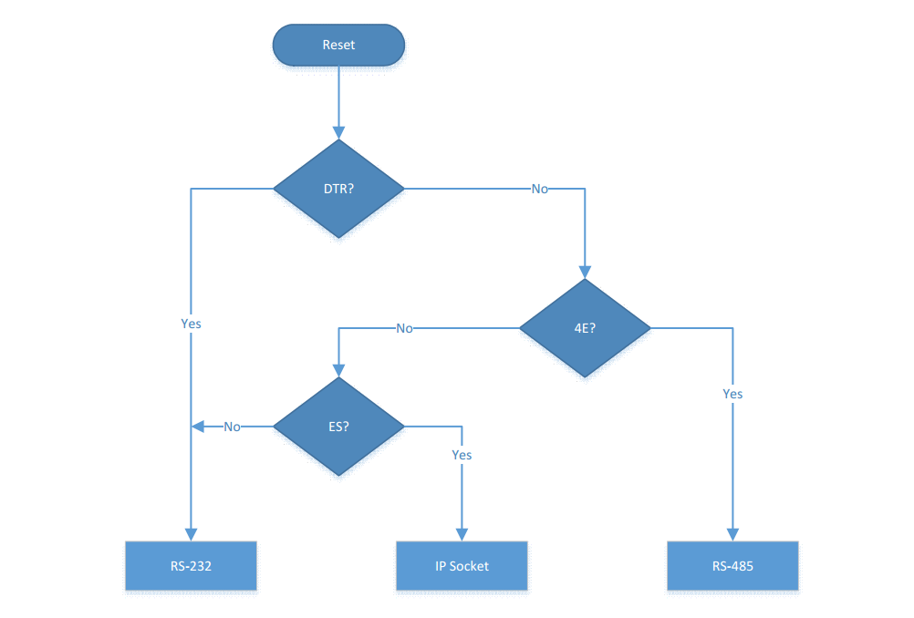
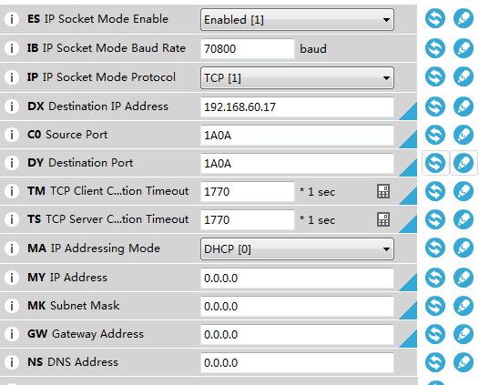
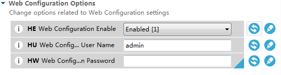
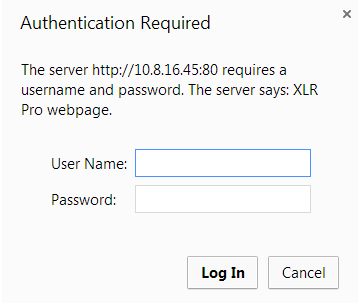
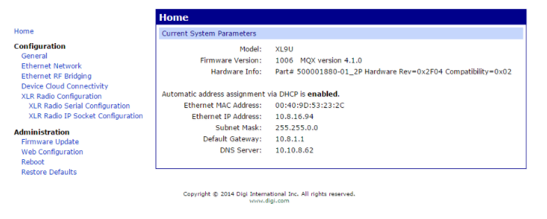

# DiGi XLR PRO modem 参考手册

## DiGi XLR PRO modem 测试

#### 1. 准备材料    
DiGi XLR PRO 模块、电源、Mini USB线、天线

#### 2. 软件与驱动安装
* 安装设备驱动    
    根据模块提供的手册，将各个模块连接起来。然后PC上面就会显示安装驱动不成功（DiGi XLR PRO 模块需要手动安装驱动）。安装步骤如下：    
    1. 打开 __设备管理器__ 。    
    2. 找到相对应的设备，并右键，然后选择 __“更新驱动程序软件”__ 。    
    3. 选择 __“浏览计算机以查找驱动程序软件”__ 。    
    4. 将搜索路径修改为文件夹 __“DiGi XLR PRO driver”__ 所在的路径。    
    5. 点击 __“下一步”__ 即可安装。    
* 安装配置软件    
    双击 __XCTU 安装包.exe__ 即可安装。

#### 3. 开始测试    
* 运行XCTU
* 点击搜索并添加对应的设备
* 点击打开控制台
* 点击打开串口
* 在 __send packets__ 下面的添加测试数据，并设置为 __loop infinitely__ 回环测试
* 如上所述，配置第二个模块

### 注意
* 两个相互通信的模块需要设置相同的 __Network ID__ 。
* 在测试的时候，两个模块需要分别放置在相隔4米（或4米以上）的两个地方测试。

## 功能介绍与应用

### 使用前须知
    
简述：这是XLR PRO使用哪种类型接口作为数据传输通道的检测流程图，在你想要使用特定的接口之前，应该根据这张图来接线和配置参数。

#### 1.RS232的使用
* 在使用RS232接口的时候，需要准备RJ45/DB9的适配器（注意接线顺序）和一般的网线。
* 配置参数有 __BD__ （串口波特率），__NB__ （奇偶校验位），__SB__ （停止位），__D6__ （RTS），__D7__ （CTS），__FT__ （流控阈值）。
* 使用网线连接RJ45/DB9适配器，然后使用USB转RS232连接PC与RJ45/DB9适配器。
* 打开串口调试助手，设置匹配的串口波特率（__BD__）即可完成通信。

#### 2.RS485的使用
* 在使用RS485接口的时候，需要准备RJ45/DB9的适配器（注意接线顺序）和一般的网线。
* 配置参数有 __BD__ （串口波特率），__NB__（奇偶校验位），__SB__（停止位），__4E__(485使能)，__4D__（全/半双工），__4T__（终端电阻）。
* 使用网线连接RJ45/DB9适配器，然后使用USB转RS232连接PC与RJ45/DB9适配器。
* 打开串口调试助手，设置匹配的串口波特率（__BD__）即可完成通信。

#### 3.IP socket的使用
* 在使用网口通信之前，需要配置的参数有 __ES__ （IP socket模式使能），__IB__（socket模式波特率，最大460800bps），__IP__（IP协议，TCP/UDP），__C0__（XLR PRO模块监听的端口号），__DY__（目标端口号），__DX__（目标IP地址），__TM__（TCP客户端连接超时），__TS__（TCP服务器连接超时），__MY__（XLR PRO模块的IP地址），__MA__（是否使用静态IP）
* 使用网线，连接XLR PRO与PC，或者XLR PRO与路由器，并且使用mini USB线连接XLR PRO与PC。
* 打开XCTU即可观察到XLR PRO分配到的IP地址（__MY__）。
* 在PC端查看PC端的IP地址，并将此IP地址设置到 __DX__ 寄存器里面去。__注意：设置完成之后，需要掉电重启，在重启之前需要拔掉mini USB线，只留下网线。__
* 打开TCP/UDP网络调试助手，根据IP地址（__MY__）创建连接，端口为（__C0__）。如图：    

* 编辑信息并发送。

#### 4.网络桥接模式
* 网络桥接模式，就是IP socket模式的拓展应用，可以用于代替网线，也就是说，一个XLR PRO连接路由器或者交换机，另一个XLR PRO连接PC，然后PC可以通过XLR PRO来上网。
* 另外，XLR PRO可以实现一对多通信，那么，多台PC（最多16）可以通过XLR PRO来实现上网。
* 需要设置的参数有 __ID__ （网络ID），__PL__（发射功率），__RR__（单一传输的重试次数），__MT__（广播的重复发送次数），__BE__（使能网络桥接），__BA__（目标地址，也就是数传的MAC地址）。
* __注意：在射频波特率小于141kbps的时候（* BR *小于3），完整的以太网数据包是不能正常工作的。如果是一对一通信，则需要设置BA为指定的地址。__

## 配置方法

#### 1.XCTU配置
* XCTU的使用请参考XCTU使用手册    
[XCTU User Guide.pdf](./doc/XCTU User Guide.pdf)

#### 2.web配置
* 配置    
    1. 使用网线连接XLR PRO模块    
    2. 使用mini USB连接设备，通过XCTU软件查看IP端口 如图：
        
    3. 配置web服务器的账号密码。 如图：
      

* 开始测试    
    1. 打开浏览器输入IP地址，出现以下界面    
        
    2. 输入配置文件所设置的用户名和密码，登陆后如图所示    
        
    3. 登录成功后即可以修改XLR PRO的配置参数    

## 参考手册
[XLR PRO User Guide.pdf](./doc/XLR PRO User Guide.PDF)    
[XLR PRO RF Getting Started Guide.pdf](./doc/XLR PRO RF Getting Started Guide.pdf)    
[XLR BOX quick start guide.pdf](./doc/XLR BOX quick start guide.pdf)    
[official website](https://www.digi.com/products/xbee-rf-solutions/boxed-rf-modems-adapters/digi-xlr-pro#productsupport-drivers)
